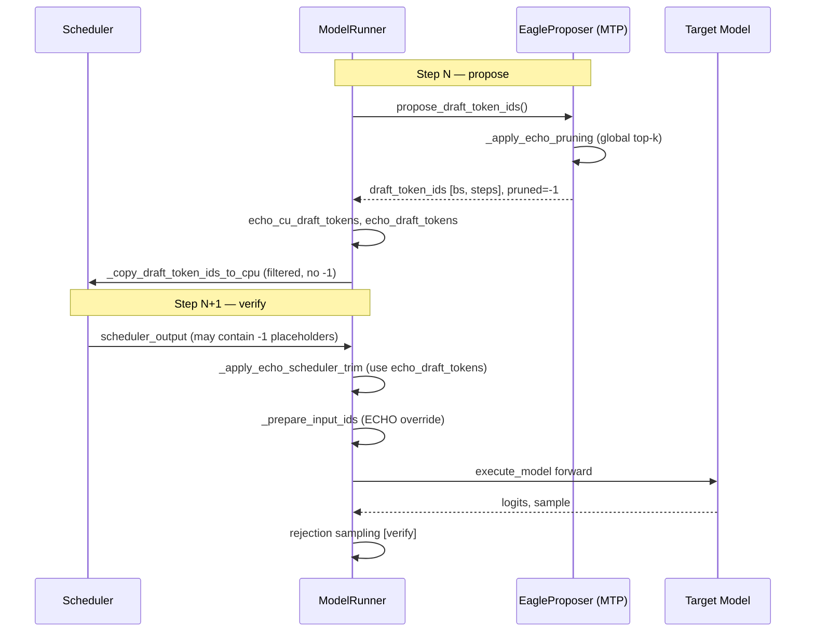

# 02 — 数据流与架构

[← 返回目录](./README.md)

## 端到端 Pipeline



## 两个核心状态字典

### `echo_cu_draft_tokens: dict[str, int]`

- **含义**：每个 `req_id` 保留的 draft **数量**（非 `-1` 的 cell 数）
- **来源**：propose 后对 `_draft_token_ids != -1` 按行计数
- **用途**：`_apply_echo_scheduler_trim` 中计算 `new_num_scheduled_tokens = kept_count + 1`

### `echo_draft_tokens: dict[str, list[int]]`

- **含义**：每个 `req_id` 保留的 draft **token ID 列表**（已过滤 `-1`）
- **来源**：`_get_draft_token_ids_cpu()` 过滤后的行
- **用途**：trim 时写入 `scheduled_spec_decode_tokens`；`_prepare_input_ids` 写入 target forward 的 `input_ids`

### 为什么要区分两者？

| 维度 | `echo_cu_draft_tokens` | `echo_draft_tokens` |
|------|------------------------|---------------------|
| 类型 | `int`（计数） | `list[int]`（实际 token） |
| 主要消费者 | scheduler 调度量计算 | input_ids / spec token 内容 |
| 能否从 scheduler 读到 | 可以间接推导 | **不能** — scheduler 里常是全 `-1` placeholder |

**关键原因**：vLLM scheduler 的 `update_draft_token_ids_in_output` 在 draft 被过滤为空后，会把 `scheduled_spec_decode_tokens` **pad 回 `-1` 占位符**。若 trim 只读 scheduler 的 spec tokens 并做 `[:count]` 切片，会得到 `kept_spec=[]`，target forward 收不到有效 draft。

因此必须在 propose 阶段 **本地保存真实 token**，trim 时用 `echo_draft_tokens` 而非 scheduler 里的 placeholder。

## Scheduler 与 Worker 的顺序问题

- `echo_*` 字典按 **`input_batch.req_ids` 或 `_draft_token_req_ids`** 顺序构建，key 为 `req_id`
- `scheduler_output.num_scheduled_tokens.keys()` 是 **scheduler running 队列顺序**
- 多请求时两者顺序可能不一致（尤其 `_may_reorder_batch` 会把 decode 请求前置）

**错误做法**（已修复）：

```python
# ❌ 按 dict key 顺序 zip，会导致 req 错配
for req_id, count in zip(scheduler_output.num_scheduled_tokens.keys(),
                         self.echo_cu_draft_tokens):
    ...
```

**正确做法**：

```python
# ✅ 用 req_id 查 dict
draft_token_num = self.echo_cu_draft_tokens.get(req_id, 0)
proposed_drafts = self.echo_draft_tokens.get(req_id, [])
```

## Target vs Draft 的 batch 形态

| 阶段 | batch 形态 | 说明 |
|------|-----------|------|
| Target verify | varlen | 每 req `1 + kept_drafts` token，不 pad 到统一长度 |
| Draft propose | 固定 `[bs, draft_step]` | 被剪位置为 `-1`，tensor 形状不变 |
