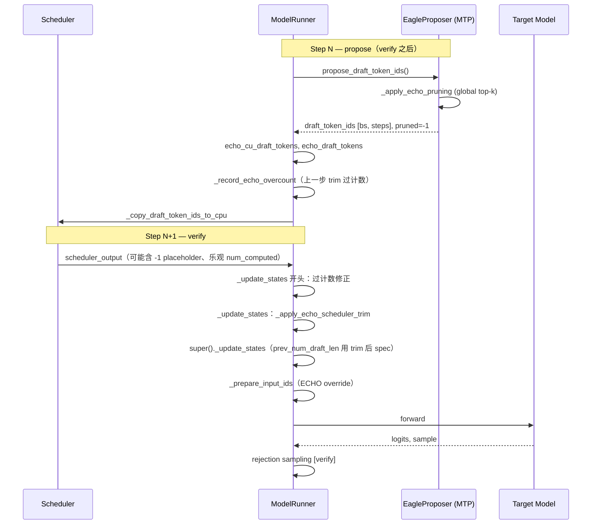

# 02 — 数据流与架构

[← 返回目录](./README.md)

## 端到端 Pipeline



## 核心状态字典

### `echo_cu_draft_tokens: dict[str, int]`

- **含义**：每个 `req_id` 保留的 draft **数量**
- **来源**：propose 后对 `_draft_token_ids != -1` 按行计数
- **用途**：trim 时判断请求是否参与上一轮 propose；计算 `new_num_scheduled = kept + 1`

### `echo_draft_tokens: dict[str, list[int]]`

- **含义**：每个 `req_id` 保留的 draft **token ID 列表**
- **来源**：`_get_draft_token_ids_cpu()` 过滤 `-1`
- **用途**：trim 写入 `scheduled_spec_decode_tokens`；`_prepare_input_ids` 写入 forward

### `echo_prev_scheduled: dict[str, int]`

- **含义**：trim **前** scheduler 对该 req 的 `num_scheduled_tokens`（`old_sched`）
- **来源**：`_apply_echo_scheduler_trim` 内记录
- **用途**：与 verify 后 `valid_count` 对比，计算过计数

### `echo_overcount_pending: dict[str, int]`

- **含义**：待在下一次 `_update_states` 从 `num_computed_tokens` 减去的量
- **计算**：`over = old_sched - valid_count`（如 8 - 1 = 7）
- **用途**：修正 async scheduling 按 trim 前调度量乐观推进的 drift

## Trim 规则（重要）

| 请求类型 | 是否在 `echo_cu_draft_tokens` | trim 行为 |
|----------|------------------------------|-----------|
| 上一轮 propose 参与的 decode | 是 | 按 keep 数裁剪 schedule |
| prefill / chunked-prefill | **否** | **跳过**，保持原 schedule（如 2673） |
| echo_keep=0（全剪枝） | 是（值为 0） | `new_sched=1`，删除 spec entry |

```python
if req_id not in self.echo_cu_draft_tokens:
    continue  # 关键：不 default 0
```

## Scheduler 与 Worker 的 req_id 映射

- 必须用 **`req_id` 查 dict**，禁止按 dict iteration 顺序 zip
- `echo_*` 字典 key 为 `req_id`，与 `input_batch.req_ids` / scheduler 队列顺序无关

## num_computed_tokens 两条校正路径

| 机制 | 条件 | 作用 |
|------|------|------|
| `update_num_computed_tokens_for_batch_change` | `prev_drafts > 0` | async spec decode GPU 漂移校正 |
| `_record_echo_overcount` + `_update_states` | ECHO trim 发生 | 修正 scheduler 按 old_sched 乐观推进的多计 |

二者互补：**不要** 将 `update_num_computed_tokens` 的 participating 放宽到全部 continuing 请求（会导致负 position）。

## Target vs Draft 的 batch 形态

| 阶段 | batch 形态 | 说明 |
|------|-----------|------|
| Target verify | varlen | 每 req `1 + kept_drafts` token |
| Draft propose | 固定 `[bs, draft_step]` | 剪枝位置为 `-1` |
